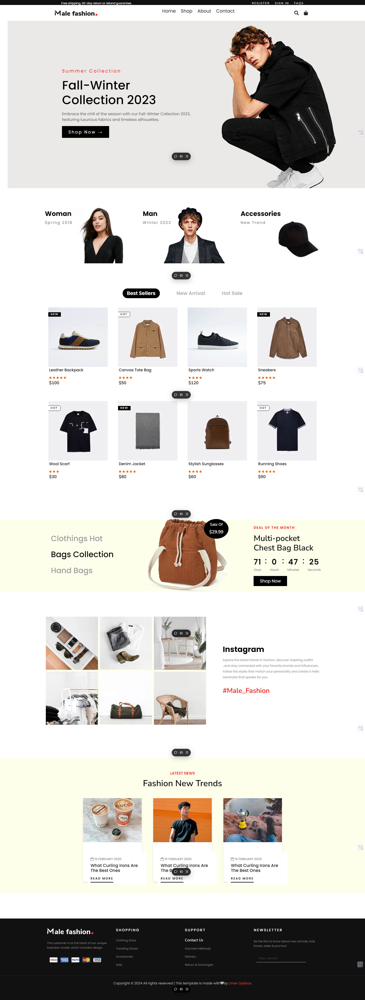
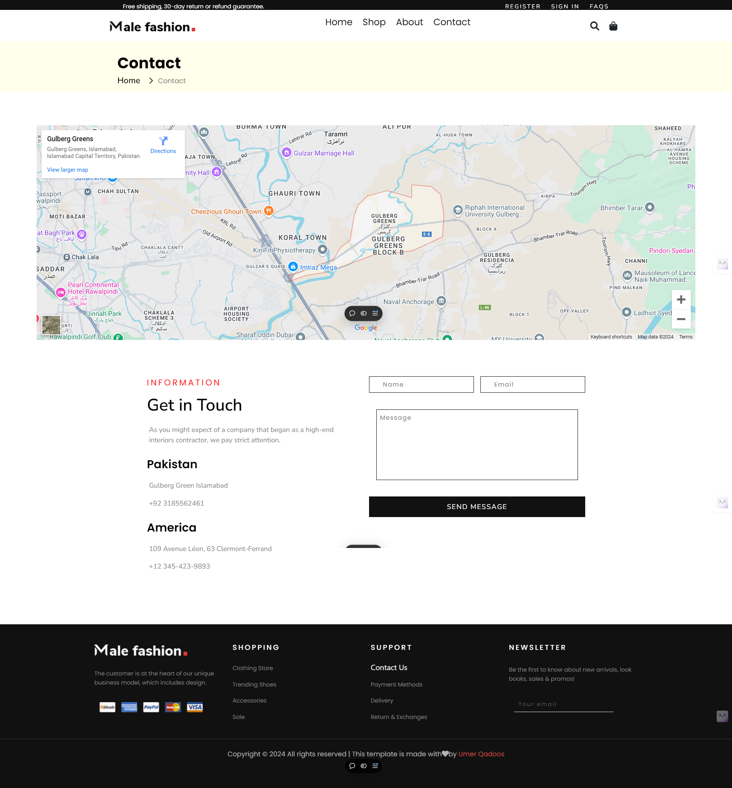
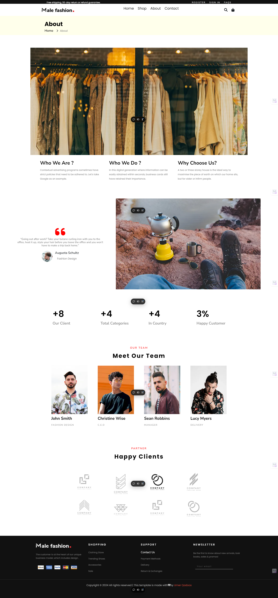

---

# Male Fashion Ecommerce Website

This is a fully responsive ecommerce website built using **Next.js**. The project demonstrates dynamic features such as a **product gallery**, **contact page**, and **about page**, making it a great showcase of a full-fledged web application for fashion enthusiasts. - [Male Fashion Ecommerce Website Link](https://male-fashion-ecommerece-website.vercel.app/) - 

## 🌟 About Me

👋 **Full Stack Developer & AI Enthusiast:**

With over 2 years of experience in building **scalable web applications** and **AI-driven solutions**, I’m here to bring your tech ideas to life—fast, secure, and innovative. Whether you need a responsive web app, an AI chatbot, or cutting-edge AI integrations, I provide solutions from concept to deployment.

💡 **Need Full Stack Web & AI Solutions?**

From building dynamic websites using **Next.js**, **React.js**, **TypeScript**, and **Python** to integrating AI chatbots powered by **Langchain** and **OpenAI**, I create custom solutions that enhance user engagement and boost business performance.

🚀 **Why Work With Me?**

I don't just code—I create real business outcomes. My projects include:

- AI Chatbots & Automation
- Custom Web App Development
- Cloud-Native Application Architecture
- AI Integration for Enhanced Business Performance

📞 **Let’s Connect!**  
If you're ready to bring your tech vision to life, feel free to reach out. I’m here to build intelligent, scalable solutions that take your business to the next level.

---

## Project Features

- **Product Showcase:** A visually engaging and fully responsive shop page with filtering options.
- **About Us:** Detailed about section that explains the brand story and team.
- **Contact Page:** A simple, intuitive contact form for visitors to reach out.

### 📸 Screenshots

#### Homepage:


#### Shop Page:


#### About Us Page:


#### Contact Page:


---

## Getting Started

To run this project on your local environment, follow these steps:

1. Clone the repository:
   ```bash
   git clone https://github.com/your-username/your-repo-name.git
   ```
   
2. Navigate to the project directory:
   ```bash
   cd your-repo-name
   ```

3. Install dependencies:
   ```bash
   npm install
   ```

4. Run the development server:
   ```bash
   npm run dev
   ```

5. Open [http://localhost:3000](http://localhost:3000) in your browser to see the website.

---

## Learn More

To learn more about **Next.js**, check out the following resources:

- [Next.js Documentation](https://nextjs.org/docs) - Learn about Next.js features and API.
- [Learn Next.js](https://nextjs.org/learn) - An interactive Next.js tutorial.

---

## Deploy on Vercel

The easiest way to deploy your Next.js app is with [Vercel](https://vercel.com). For more details, check out the [Next.js deployment documentation](https://nextjs.org/docs/app/building-your-application/deploying).

---

